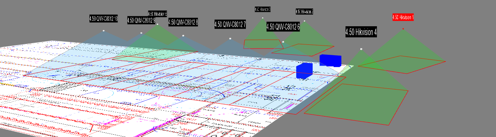
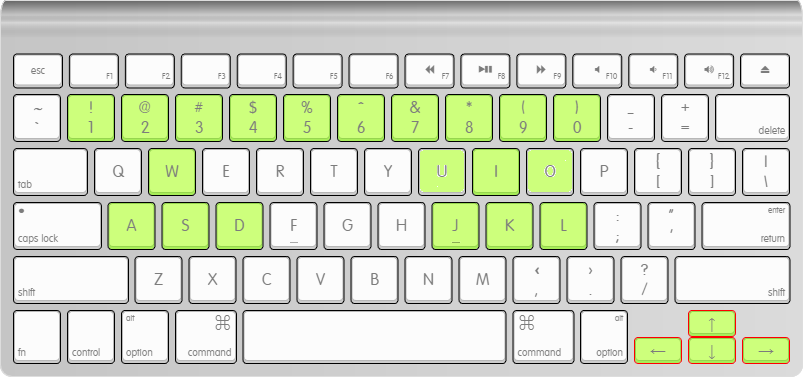

# Whyndhurst CCTV FoV Simulator
This repository contains the source code and binaries for a 3D simulator of the field of views of the CCTV installed on farm.

  

## How To Use

1) Download and extract dist.zip
2) Double click main.exe

  

| Key                     | Action                                   |
|-------------------------|------------------------------------------|
| W A S D                 | View translation left/right forward/backward |
| Arrow keys              | View rotation                            |
| I J K L                 | Camera tilt                              |
| 1-9                     | Camera selection                         |
| Mouse wheel             | Camera up/down                           |
| Mouse left click + drag | Camera position                    |